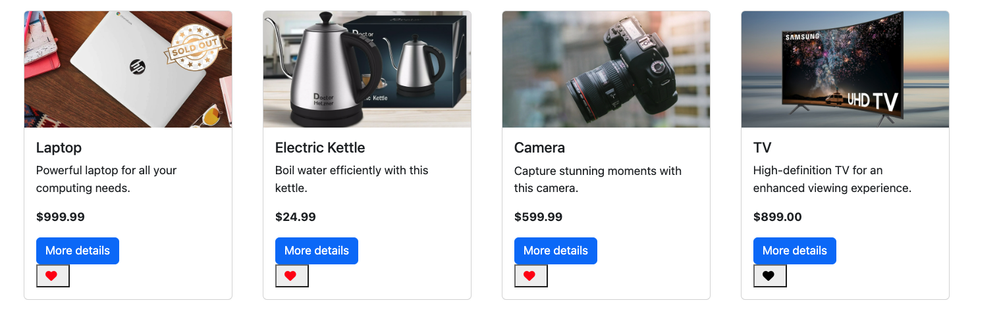

# Midterm Buy/Sell Website Project
Greg's List is a full stack web application built with Node and express to Buy and Sell your favourite products via different listings!(like craig's list or kijiji)

## Final Product
##### Login Page

##### Featured Listings Page

##### Full Listings Page

##### Individual product details 

##### Sell Items Page

##### Favorites Page

##### Send email button triggering the email

##### Individual sold out product

##### Full Listing with sold out products

## Dependencies

- Node.js
- bcryptjs
- bootstrap
- chalk
- cookie-session
- dotenv
- EJS
- express
- morgan"
- pg
- sass

## Dev Dependencies:
- Nodemon

## Getting Started
1. Clone this repo and Create the .env by using .env.example as a reference: 
    - cp .env.example .env
2. Update the .env file with your correct local information
    - username: labber
    - password: labber
    - database: midterm
3. Install all dependencies (using the npm install command).
4. Fix to binaries for sass: npm rebuild node-sass
5. Reset database: npm run db:reset
    - Check the db folder to see what gets created and seeded in the SDB
6. Run the server: npm run local

## How to use the app

- Start your node server
- Browse to http://localhost:8060/
- Login as below users and start buying/selling products
    - user1.example.com(Admin)
    - user2.example.com
    - user3.example.com
    - user4.example.com
    - user5.example.com

Enjoy!
