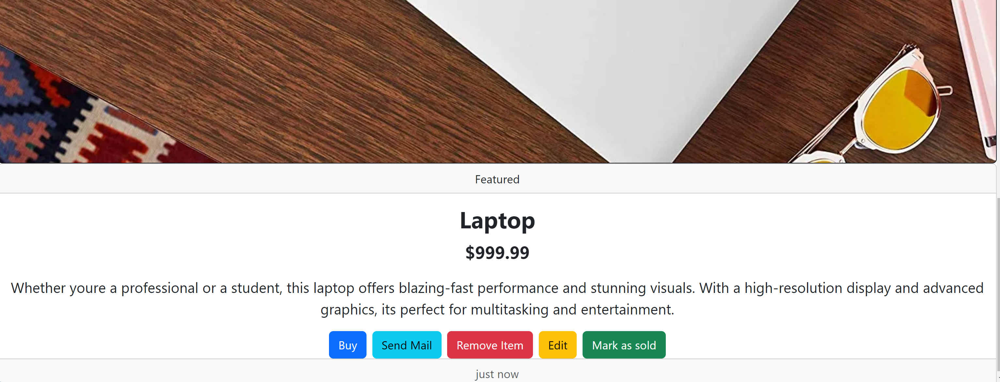

# Midterm Buy/Sell Website Project
Greg's List is a full stack web application built with Node and express to Buy and Sell your favourite products via different listings!(like craig's list or kijiji)

## Project Overview

The main objective of Greg's List is to provide a platform for users to engage in buying and selling activities. The application offers a range of features to facilitate these interactions, including user authentication, listing creation, product details, favoriting items, and communication through email.

## Screenshots

Here are some screenshots of different pages and features within the Greg's List application:

##### Login Page

##### Featured Listings Page

##### Full Listings Page

##### Individual product details 

##### Sell Items Page

##### Favorites Page

##### Send email button triggering the email

##### Individual sold out product

##### Full Listing with sold out products

##### Full listing can be filtered by price

## Dependencies

- Node.js
- bcryptjs
- bootstrap
- chalk
- cookie-session
- dotenv
- EJS
- express
- morgan"
- pg
- sass
- timeago.js

## Dev Dependencies:
- Nodemon

## Getting Started
1. Clone this repo and Create the .env by using .env.example as a reference: 
    - cp .env.example .env
2. Update the .env file with your correct local information
    - username: labber
    - password: labber
    - database: midterm
3. Install all dependencies (using the npm install command).
4.  Start PostgreSQL 10 database server: 
startpostgres
5. Fix to binaries for sass: npm rebuild node-sass
6. Reset database: npm run db:reset
    - Check the db folder to see what gets created and seeded in the SDB
7. Run the server: npm run local

## How to use the app

- Start your node server
- Browse to http://localhost:8060/
- Login as below users and start buying/selling products
- Users can edit any items that they post
- Admins can edit all items
    - Email: user1.example.com(Admin),
        Password: password
    - Email: user2.example.com,
        Password: password
    - Email: user3.example.com,
        Password: password
    - Email: user4.example.com,
        Password: password
    - Email: user5.example.com,
        Password: password

## Contributions

- Chandani Kumari
- Noah McMillan
- Steven Serruya

Enjoy!